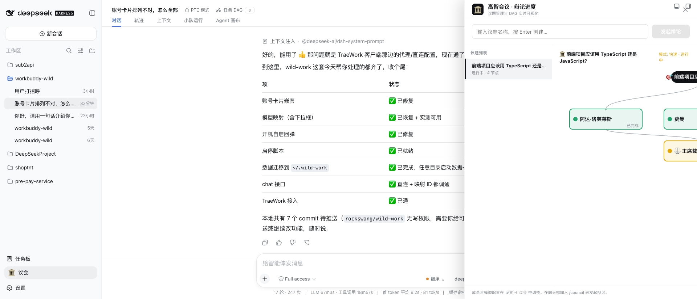
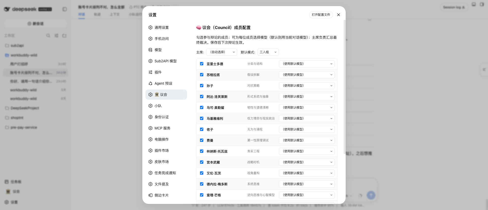

# dsh-council — 高智议会（Council of High Intelligence）for DeepSeek Harness

在 dsh（DeepSeek Harness）里召集历史人物议会，对复杂问题进行多视角结构化辩论，最终由主席综合裁决。

> **本项目基于 [0xNyk/council-of-high-intelligence](https://github.com/0xNyk/council-of-high-intelligence) 开发**，将其适配为 dsh 插件：技能层（SKILL.md + agents/）沿用原项目协议，新增了 dsh 专属的侧边栏入口、右侧 DAG 面板、SQLite 历史数据持久化与进度上报 API。

- **18 位议会成员**：亚里士多德、苏格拉底、孙子、阿达、费曼、托瓦兹、芒格、卡尼曼、塔勒布、卡帕西等
- **右侧 DAG 面板**：实时可视化辩论进度（议题 → 成员 → 主席），节点可点击跳转子会话，不遮挡左侧导航栏
- **多种模式**：`--quick` 快闪、`--duo` 二人对辩、`--triad` 三人组、`--full` 全员、`--members` 自选
- **项目覆盖**：通过 `./.council.yaml` 固定每项目的默认 panel/chairman

## 截图

### 议会面板（右侧抽屉，不遮挡左侧导航栏）



### 议会配置（设置 → 议会）



## 功能

| 功能 | 说明 |
|------|------|
| `/council` 命令 | 启动议会辩论，自动路由 panel 与模式 |
| 侧边栏入口 | 左侧栏底部「🏛️ 议会」按钮，点击展开/收起右侧面板 |
| 右侧面板 | 议题列表 + DAG 实时进度图，支持节点点击跳转子会话 |
| 历史持久化 | SQLite 存储（`~/.dsh/council/council.sqlite`），重启不丢历史议题 |
| 进度上报 API | `/council/api/progress/report` — 协调器通过 HTTP 上报每个成员的运行状态 |
| 配置持久化 | `~/.dsh/council/config.json` — 成员启用/禁用、模型映射、默认 chairman |

## 安装

### 方式一：git 依赖（发布后推荐）

```bash
# 在 profile 目录执行
cd ~/.dsh/profiles/web
pnpm add dsh-council@git+https://github.com/fufengyuan/dsh-council.git
# 或
dsh plugin --profile web add git+https://github.com/fufengyuan/dsh-council.git
```

### 方式二：本地源码（开发调试）

```bash
git clone https://github.com/fufengyuan/dsh-council.git ~/.dsh/plugin-src/dsh-council
# 然后在 profile 的 package.json dependencies 里加：
# "dsh-council": "file:../../plugin-src/dsh-council"
```

两种方式装完都需重启 dsh web 服务：`dsh-webctl restart`。

### 可选依赖

`js-yaml` 用于读取 `~/.dsh/settings.yaml` 的模型列表（`optionalDependencies`），缺失时自动降级跳过，不影响其他功能。

## 使用

```bash
# 在 dsh 会话里触发
/council 一个技术决策：前端项目应该用 TypeScript 还是 JavaScript？
/council --quick 是否应该引入缓存？
/council --triad architecture 用 monorepo 还是 polyrepo？
/council --full 我们 SaaS 产品怎么定价？
/council --members socrates,feynman,ada 我们的缓存策略对吗？
/council --duo 微服务还是单体？
```

侧边栏点「🏛️ 议会」展开/收起右侧面板，实时查看辩论 DAG。历史议题持久化在 `~/.dsh/council/council.sqlite`，重启服务不丢失。

## 架构

```
council/
├── SKILL.md              # /council 命令的协调器指令
├── agents/               # 18 位议会成员 persona（council-{name}.md）
├── configs/              # auto-route-defaults.yaml（triads/profiles/极性对）
├── dsh/index.js          # 服务端 HTTP API（run 管理 + DAG 进度 + SQLite 持久化）
├── lib/client.js         # 客户端 UI（侧边栏按钮 + 右侧抽屉面板 + DAG 渲染）
├── package.json          # 插件元数据（dsh bundle/client 声明）
└── cordis.patch.yml      # bundle patch（挂载 dsh-council 插件）
```

数据存储：`~/.dsh/council/council.sqlite`（SQLite，WAL 模式）保存 runs / nodes / edges，配置存 `~/.dsh/council/config.json`。

## 开发

```bash
node --check lib/client.js   # 客户端语法校验
node --check dsh/index.js    # 服务端语法校验
dsh-webctl restart           # 重启后浏览器硬刷新
```

## 进度上报 API

协调器（SKILL.md 中的 Council Coordinator）通过 HTTP 上报每个成员的运行状态，DAG 面板实时更新：

```bash
# 创建 run
curl -s -X POST http://127.0.0.1:3080/council/api/progress/report \
  -H 'content-type: application/json' -d '{"problem":"...","mode":"--quick"}'
# 成员节点
curl -s -X POST http://127.0.0.1:3080/council/api/progress/report \
  -H 'content-type: application/json' -d '{"runId":"<id>","nodeId":"feynman-r1","label":"费曼 首轮盲评","status":"running"}'
# 关闭 run
curl -s -X POST http://127.0.0.1:3080/council/api/progress/report \
  -H 'content-type: application/json' -d '{"runId":"<id>","nodeId":"close","status":"done","done":true}'
```

## License

MIT
